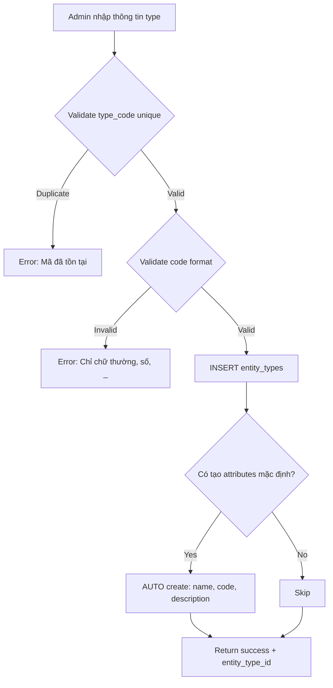
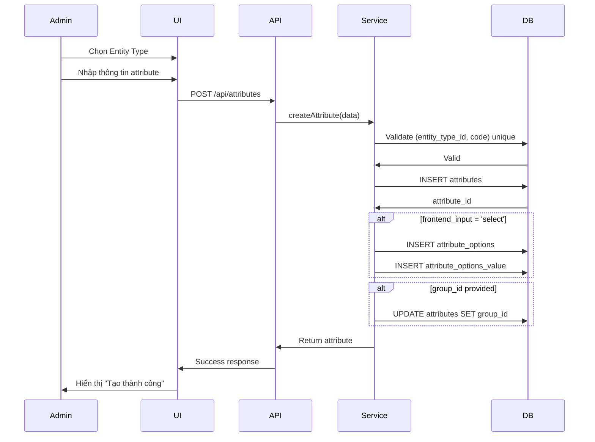
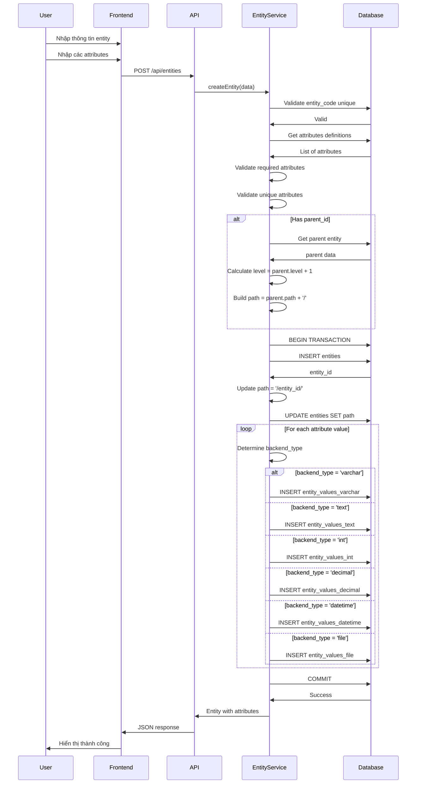

## 📋 MỤC LỤC

1. [Tổng quan hệ thống](#1-tổng-quan-hệ-thống)
2. [Nghiệp vụ 1: Quản lý Entity Types (Loại đối tượng)](#2-nghiệp-vụ-1-quản-lý-entity-types)
3. [Nghiệp vụ 2: Quản lý Attributes (Trường động)](#3-nghiệp-vụ-2-quản-lý-attributes)
4. [Nghiệp vụ 3: Quản lý Entities (Đối tượng thực)](#4-nghiệp-vụ-3-quản-lý-entities)
5. [Nghiệp vụ 4: Quản lý Relations (Quan hệ đa chiều)](#5-nghiệp-vụ-4-quản-lý-relations)
6. [Nghiệp vụ 5: Phân cấp cây (Tree Hierarchy)](#6-nghiệp-vụ-5-phân-cấp-cây)
7. [Nghiệp vụ 6: Tìm kiếm và Lọc](#7-nghiệp-vụ-6-tìm-kiếm-và-lọc)
8. [Ma trận Bảng - Nghiệp vụ](#8-ma-trận-bảng-nghiệp-vụ)

---

## 1. TỔNG QUAN HỆ THỐNG

### 1.1. Điểm khác biệt so với EAV truyền thống

| Đặc điểm | EAV Truyền thống | EAV Động 100% (Hệ thống này) |
|----------|------------------|------------------------------|
| Cấu trúc | Cố định pattern (Plant→Zone→Workshop) | Tự do tạo bất kỳ type nào |
| Entity Types | Pre-defined | Tạo mới qua INSERT data |
| Attributes | Gắn cứng với type | Tạo mới cho bất kỳ type |
| Quan hệ | Parent-child đơn giản | Đa chiều, tự định nghĩa |
| Mở rộng | Cần sửa code | Chỉ cần INSERT data |

### 1.2. Kiến trúc 5 Layers

```
Layer 1: ENTITY TYPES
         ↓
         Định nghĩa loại đối tượng (Hospital, Zone, Product...)
         
Layer 2: ATTRIBUTES  
         ↓
         Định nghĩa trường cho từng type
         
Layer 3: ENTITIES
         ↓
         Dữ liệu thực tế (HS-001, ZN-COOK-01...)
         
Layer 4: ENTITY VALUES
         ↓
         Giá trị attributes lưu trong 6 bảng value
         
Layer 5: ENTITY RELATIONS
         ↓
         Quan hệ tự do giữa entities
```

### 1.3. Các bảng chính

| Bảng | Layer | Mục đích |
|------|-------|----------|
| `entity_types` | 1 | Định nghĩa loại (hospital, zone, product...) |
| `attributes` | 2 | Định nghĩa trường động |
| `attribute_groups` | 2 | Nhóm trường thành tabs |
| `attribute_options` | 2 | Options cho select/multiselect |
| `entities` | 3 | Dữ liệu thực tế |
| `entity_values_varchar` | 4 | Giá trị text ngắn |
| `entity_values_text` | 4 | Giá trị text dài |
| `entity_values_int` | 4 | Giá trị số nguyên |
| `entity_values_decimal` | 4 | Giá trị số thập phân |
| `entity_values_datetime` | 4 | Giá trị ngày giờ |
| `entity_values_file` | 4 | File uploads |
| `entity_relations` | 5 | Quan hệ đa chiều |

---

## 2. NGHIỆP VỤ 1: QUẢN LÝ ENTITY TYPES

### 2.1. Mô tả nghiệp vụ

**Tự do tạo các loại đối tượng mới** mà không cần code trước. Có thể tạo cho:
- Nhà máy: Plant, Zone, Workshop, Line, Station
- Bệnh viện: Hospital, Department, Room, Bed
- Sản phẩm: Category, Product, SKU, Variant
- Tổ chức: Company, Department, Team, Employee

### 2.2. User Stories

**US-1.1: Tạo entity type mới**
```
Là admin
Tôi muốn tạo loại "Bệnh viện" (Hospital)
Để quản lý hệ thống bệnh viện thay vì nhà máy
```

**US-1.2: Xem danh sách entity types**
```
Là admin
Tôi muốn xem tất cả loại đã tạo
Để chọn và quản lý chúng
```

**US-1.3: Cấu hình hiển thị**
```
Là admin
Tôi muốn chọn icon, màu sắc, prefix cho mỗi type
Để dễ phân biệt trên UI
```

### 2.3. Bảng liên quan

#### Bảng chính: `entity_types`

| Field | Type | Mô tả | Example | Required |
|-------|------|-------|---------|----------|
| entity_type_id | INT | ID tự tăng | 1 | PK |
| type_code | VARCHAR(100) | Mã loại (unique) | 'hospital', 'zone', 'product' | YES, UNIQUE |
| type_name | VARCHAR(255) | Tên tiếng Việt | 'Bệnh viện', 'Khu vực' | YES |
| type_name_en | VARCHAR(255) | Tên tiếng Anh | 'Hospital', 'Zone' | NO |
| icon | VARCHAR(100) | Icon class hoặc emoji | 'hospital', '🏥' | NO |
| color | VARCHAR(20) | Mã màu hiển thị | '#1976d2', 'rgb(25,118,210)' | NO |
| code_prefix | VARCHAR(10) | Tiền tố mã entity | 'HS', 'ZN', 'PRD' | NO |
| description | TEXT | Mô tả chi tiết | 'Quản lý bệnh viện' | NO |
| config | JSON | Cấu hình tùy chỉnh | `{"allow_duplicate": true}` | NO |
| is_system | BOOLEAN | Do hệ thống tạo | FALSE | DEFAULT 0 |
| is_active | BOOLEAN | Kích hoạt | TRUE | DEFAULT 1 |
| sort_order | INT | Thứ tự hiển thị | 1, 2, 3... | DEFAULT 0 |
| created_at | DATETIME | Ngày tạo | 2025-10-24 10:00:00 | AUTO |
| updated_at | DATETIME | Ngày cập nhật | 2025-10-24 11:30:00 | AUTO |

#### Config JSON Examples

**Example 1: Hospital config**
```json
{
  "allow_duplicate_codes": false,
  "require_parent": false,
  "max_level": null,
  "default_attributes": ["name", "code", "address"],
  "ui_config": {
    "list_view": "table",
    "enable_tree": false
  }
}
```

**Example 2: Zone config (Factory)**
```json
{
  "allow_duplicate_codes": false,
  "require_parent": true,
  "parent_types": ["plant"],
  "child_types": ["workshop"],
  "max_level": 5,
  "enable_hierarchy": true
}
```

### 2.4. Business Rules

| Rule ID | Mô tả | Implementation | Severity |
|---------|-------|----------------|----------|
| BR-1.1 | type_code phải unique | UNIQUE constraint | ERROR |
| BR-1.2 | type_code chỉ chứa chữ thường, số, gạch dưới | Regex: `^[a-z0-9_]+$` | ERROR |
| BR-1.3 | Không xóa type đang có entities | Check FK before delete | ERROR |
| BR-1.4 | Không xóa type có is_system=1 | WHERE is_system=0 | ERROR |
| BR-1.5 | code_prefix nên unique (không bắt buộc) | Validate before insert | WARNING |

### 2.5. API Endpoints

```
POST   /api/entity-types              # Tạo mới
GET    /api/entity-types              # Danh sách
GET    /api/entity-types/{id}         # Chi tiết
PUT    /api/entity-types/{id}         # Cập nhật
DELETE /api/entity-types/{id}         # Xóa
GET    /api/entity-types/{id}/stats   # Thống kê số entities
```

### 2.6. Request/Response Examples

**Request: Tạo Hospital type**
```json
POST /api/entity-types
{
  "type_code": "hospital",
  "type_name": "Bệnh viện",
  "type_name_en": "Hospital",
  "icon": "🏥",
  "color": "#2196F3",
  "code_prefix": "HS",
  "description": "Quản lý bệnh viện và phòng khám",
  "config": {
    "allow_duplicate_codes": false,
    "require_parent": false,
    "enable_hierarchy": true
  }
}
```

**Response: Success**
```json
{
  "success": true,
  "message": "Tạo entity type thành công",
  "data": {
    "entity_type_id": 1,
    "type_code": "hospital",
    "type_name": "Bệnh viện",
    "icon": "🏥",
    "color": "#2196F3",
    "created_at": "2025-10-24T10:00:00Z"
  }
}
```

### 2.7. Luồng nghiệp vụ



### 2.8. Dữ liệu mẫu

```sql
-- Tạo types cho hệ thống nhà máy
INSERT INTO entity_types 
(type_code, type_name, type_name_en, icon, color, code_prefix) 
VALUES
('plant', 'Nhà máy', 'Plant', '🏭', '#1976d2', 'PL'),
('zone', 'Khu vực', 'Zone', '📍', '#4caf50', 'ZN'),
('workshop', 'Xưởng', 'Workshop', '🏗️', '#ff9800', 'WS');

-- Tạo types cho hệ thống bệnh viện
INSERT INTO entity_types 
(type_code, type_name, type_name_en, icon, color, code_prefix) 
VALUES
('hospital', 'Bệnh viện', 'Hospital', '🏥', '#2196F3', 'HS'),
('department', 'Khoa', 'Department', '🏛️', '#9c27b0', 'DP'),
('room', 'Phòng', 'Room', '🚪', '#f44336', 'RM');
```

---

## 3. NGHIỆP VỤ 2: QUẢN LÝ ATTRIBUTES

### 3.1. Mô tả nghiệp vụ

**Tạo trường động cho bất kỳ entity type nào**. Attributes có thể:
- Gắn với 1 type cụ thể (`entity_type_id = 1`)
- Hoặc shared across types (`entity_type_id = NULL`)

### 3.2. User Stories

**US-2.1: Tạo attribute cho Hospital**
```
Là admin
Tôi muốn thêm trường "Địa chỉ" (address) cho Hospital
Kiểu text, bắt buộc nhập
```

**US-2.2: Tạo shared attribute**
```
Là admin
Tôi muốn tạo trường "Ghi chú" dùng chung cho tất cả types
Để mọi entity đều có thể có ghi chú
```

**US-2.3: Tạo attribute có options**
```
Là admin
Tôi muốn tạo trường "Loại hình" (type) cho Hospital
Với options: Công lập, Tư nhân, Quốc tế
```

### 3.3. Bảng liên quan

#### Bảng chính: `attributes`

| Field | Type | Mô tả | Values | Required |
|-------|------|-------|--------|----------|
| attribute_id | INT | ID | | PK |
| entity_type_id | INT | Thuộc type nào (NULL = shared) | 1, 2, NULL | FK nullable |
| attribute_code | VARCHAR(100) | Mã trường | 'address', 'capacity' | YES |
| attribute_label | VARCHAR(255) | Nhãn hiển thị | 'Địa chỉ', 'Công suất' | YES |
| **backend_type** | ENUM | **Kiểu lưu trữ** | 'varchar', 'text', 'int', 'decimal', 'datetime', 'file' | YES |
| **frontend_input** | ENUM | **Kiểu input** | 'text', 'textarea', 'select', 'multiselect', 'date', 'datetime', 'yesno', 'file' | YES |
| is_required | BOOLEAN | Bắt buộc | TRUE/FALSE | DEFAULT 0 |
| is_unique | BOOLEAN | Giá trị unique | TRUE/FALSE | DEFAULT 0 |
| is_searchable | BOOLEAN | Tìm kiếm được | TRUE/FALSE | DEFAULT 1 |
| is_filterable | BOOLEAN | Lọc được | TRUE/FALSE | DEFAULT 0 |
| default_value | TEXT | Giá trị mặc định | 'Chưa xác định' | NO |
| validation_rules | JSON | Rules validate | `{"min": 5, "max": 100}` | NO |
| max_file_count | INT | Số file tối đa | 5 | DEFAULT 1 |
| allowed_extensions | VARCHAR(255) | Extensions cho phép | 'jpg,png,pdf' | NO |
| max_file_size_kb | INT | Kích thước file (KB) | 2048 | NO |
| placeholder | VARCHAR(255) | Placeholder | 'Nhập địa chỉ...' | NO |
| help_text | TEXT | Text hướng dẫn | 'VD: 123 Lê Lợi, Q1' | NO |
| frontend_class | VARCHAR(100) | CSS class | 'col-md-6' | NO |
| sort_order | INT | Thứ tự hiển thị | 1, 2, 3... | DEFAULT 0 |
| group_id | INT | Thuộc group nào | FK | NO |
| is_system | BOOLEAN | Trường hệ thống | FALSE | DEFAULT 0 |
| is_user_defined | BOOLEAN | Do user tạo | TRUE | DEFAULT 1 |

#### Backend Type - Frontend Input Mapping

| backend_type | frontend_input | Lưu ở bảng | Use cases |
|--------------|----------------|------------|-----------|
| varchar | text | entity_values_varchar | Tên, mã, email, phone |
| varchar | select | entity_values_varchar | Status (lưu option_id) |
| varchar | yesno | entity_values_varchar | True/False (lưu '1'/'0') |
| text | textarea | entity_values_text | Mô tả, ghi chú dài |
| int | text | entity_values_int | Số lượng, công suất |
| int | select | entity_values_int | Options (lưu option_id) |
| decimal | text | entity_values_decimal | Diện tích, giá, trọng lượng |
| datetime | date | entity_values_datetime | Ngày sinh, deadline |
| datetime | datetime | entity_values_datetime | Timestamp đầy đủ |
| file | file | entity_values_file | Upload files |

#### Bảng phụ: `attribute_groups`

| Field | Mô tả | Example |
|-------|-------|---------|
| group_id | ID nhóm | 1 |
| entity_type_id | Thuộc type | 1 (Hospital) |
| group_code | Mã nhóm | 'general', 'technical' |
| group_name | Tên nhóm | 'Thông tin chung', 'Kỹ thuật' |
| sort_order | Thứ tự | 1, 2, 3... |

#### Bảng phụ: `attribute_options` & `attribute_options_value`

**attribute_options:**
| Field | Mô tả |
|-------|-------|
| option_id | ID option |
| attribute_id | Thuộc attribute |
| sort_order | Thứ tự |
| is_default | Option mặc định |

**attribute_options_value:**
| Field | Mô tả | Example |
|-------|-------|---------|
| value_id | ID | 1 |
| option_id | Thuộc option | 1 |
| value | Label | 'Công lập', 'Tư nhân' |

### 3.4. Business Rules

| Rule ID | Mô tả | Implementation |
|---------|-------|----------------|
| BR-2.1 | attribute_code unique trong type | `(entity_type_id, attribute_code)` UNIQUE |
| BR-2.2 | Shared attribute (entity_type_id=NULL) phải có code unique toàn hệ thống | Check trước khi insert |
| BR-2.3 | backend_type quyết định bảng value | varchar→entity_values_varchar |
| BR-2.4 | Select/multiselect phải có options | Validate khi frontend_input = 'select' |
| BR-2.5 | File upload cần config extensions & size | Validate khi backend_type = 'file' |
| BR-2.6 | Không xóa system attributes | WHERE is_system = 0 |

### 3.5. API Endpoints

```
POST   /api/attributes                        # Tạo mới
GET    /api/entity-types/{typeId}/attributes  # Danh sách theo type
GET    /api/attributes/shared                 # Shared attributes
GET    /api/attributes/{id}                   # Chi tiết
PUT    /api/attributes/{id}                   # Cập nhật
DELETE /api/attributes/{id}                   # Xóa
POST   /api/attributes/{id}/options           # Thêm option
PUT    /api/attributes/reorder                # Sắp xếp
```

### 3.6. Request Examples

**Request 1: Tạo attribute "Địa chỉ" cho Hospital**
```json
POST /api/attributes
{
  "entity_type_id": 1,
  "attribute_code": "address",
  "attribute_label": "Địa chỉ",
  "backend_type": "text",
  "frontend_input": "textarea",
  "is_required": true,
  "is_searchable": true,
  "placeholder": "Nhập địa chỉ bệnh viện...",
  "help_text": "VD: 123 Nguyễn Huệ, Q1, TP.HCM",
  "sort_order": 3
}
```

**Request 2: Tạo attribute "Loại hình" với options**
```json
POST /api/attributes
{
  "entity_type_id": 1,
  "attribute_code": "hospital_type",
  "attribute_label": "Loại hình",
  "backend_type": "int",
  "frontend_input": "select",
  "is_required": true,
  "options": [
    {"label": "Công lập", "is_default": true},
    {"label": "Tư nhân", "is_default": false},
    {"label": "Quốc tế", "is_default": false}
  ]
}
```

**Request 3: Tạo shared attribute "Ghi chú"**
```json
POST /api/attributes
{
  "entity_type_id": null,
  "attribute_code": "notes",
  "attribute_label": "Ghi chú",
  "backend_type": "text",
  "frontend_input": "textarea",
  "is_required": false,
  "is_searchable": true
}
```

### 3.7. Luồng nghiệp vụ



### 3.8. Dữ liệu mẫu

```sql
-- Attributes cho Hospital
INSERT INTO attributes 
(entity_type_id, attribute_code, attribute_label, backend_type, frontend_input, is_required) 
VALUES
(1, 'address', 'Địa chỉ', 'text', 'textarea', 1),
(1, 'phone', 'Số điện thoại', 'varchar', 'text', 1),
(1, 'capacity_beds', 'Số giường', 'int', 'text', 0),
(1, 'establish_date', 'Ngày thành lập', 'datetime', 'date', 0);

-- Attribute có options
INSERT INTO attributes 
(entity_type_id, attribute_code, attribute_label, backend_type, frontend_input, is_required) 
VALUES
(1, 'hospital_type', 'Loại hình', 'int', 'select', 1);

-- Options
INSERT INTO attribute_options (attribute_id, sort_order, is_default) VALUES
(5, 1, 1), (5, 2, 0), (5, 3, 0);

INSERT INTO attribute_options_value (option_id, value) VALUES
(1, 'Công lập'),
(2, 'Tư nhân'),
(3, 'Quốc tế');

-- Shared attribute
INSERT INTO attributes 
(entity_type_id, attribute_code, attribute_label, backend_type, frontend_input) 
VALUES
(NULL, 'notes', 'Ghi chú', 'text', 'textarea');
```

---

## 4. NGHIỆP VỤ 3: QUẢN LÝ ENTITIES

### 4.1. Mô tả nghiệp vụ

Tạo và quản lý **entities thực tế** (Hospital, Zone, Product...) với dữ liệu động theo attributes đã định nghĩa.

### 4.2. User Stories

**US-3.1: Tạo Hospital mới**
```
Là user
Tôi muốn tạo Hospital "Bệnh viện Chợ Rẫy"
Với đầy đủ thông tin: mã, tên, địa chỉ, số điện thoại, loại hình
```

**US-3.2: Cập nhật thông tin**
```
Là user
Tôi muốn cập nhật số giường của Hospital
Khi có mở rộng
```

**US-3.3: Xóa entity**
```
Là user
Tôi muốn xóa Hospital không còn hoạt động
Và tất cả dữ liệu liên quan
```

### 4.3. Bảng liên quan

#### Bảng chính: `entities`

| Field | Type | Mô tả | Example | Required |
|-------|------|-------|---------|----------|
| entity_id | INT | ID | 1 | PK |
| entity_type_id | INT | Loại entity | 1 (Hospital) | YES, FK |
| entity_code | VARCHAR(100) | Mã entity | 'HS-001', 'ZN-COOK-01' | YES, UNIQUE |
| entity_name | VARCHAR(255) | Tên | 'Bệnh viện Chợ Rẫy' | YES |
| parent_id | INT | Entity cha (NULL = root) | NULL, 1, 2... | NO, FK |
| path | VARCHAR(1000) | Materialized path | '/1/5/12/' | NO |
| level | INT | Độ sâu | 0, 1, 2... | DEFAULT 0 |
| description | TEXT | Mô tả | 'Bệnh viện đa khoa hạng I' | NO |
| metadata | JSON | Dữ liệu mở rộng | `{"legacy_id": 123}` | NO |
| is_active | BOOLEAN | Kích hoạt | TRUE | DEFAULT 1 |
| sort_order | INT | Thứ tự | 1, 2, 3... | DEFAULT 0 |
| created_by | INT | Người tạo | user_id | NO |
| updated_by | INT | Người sửa | user_id | NO |
| created_at | DATETIME | Ngày tạo | | AUTO |
| updated_at | DATETIME | Ngày sửa | | AUTO |

#### Các bảng EAV Values (6 bảng)

**1. entity_values_varchar** - Text ngắn (<255)
```sql
entity_id | attribute_id | value
----------|--------------|------------------
1         | 2            | '028-1234567'     (phone)
1         | 6            | 'notes content'   (shared notes)
```

**2. entity_values_text** - Text dài
```sql
entity_id | attribute_id | value
----------|--------------|--------------------------------
1         | 1            | '280 Nguyễn Chí Thanh, Q5...'
```

**3. entity_values_int** - Số nguyên, option IDs
```sql
entity_id | attribute_id | value
----------|--------------|-------
1         | 3            | 500    (capacity_beds)
1         | 5            | 1      (hospital_type option_id)
```

**4. entity_values_decimal** - Số thập phân
```sql
entity_id | attribute_id | value
----------|--------------|----------
2         | 10           | 325.5000  (area_m2)
```

**5. entity_values_datetime** - Ngày giờ
```sql
entity_id | attribute_id | value
----------|--------------|---------------------
1         | 4            | 1975-06-15 00:00:00
```

**6. entity_values_file** - Files
```sql
entity_id | attribute_id | file_path                    | file_name | file_size | mime_type
----------|--------------|------------------------------|-----------|-----------|------------
1         | 8            | /uploads/hospitals/1/img.jpg | image.jpg | 204800    | image/jpeg
```

### 4.4. Business Rules

| Rule ID | Mô tả | Implementation |
|---------|-------|----------------|
| BR-3.1 | entity_code unique toàn hệ thống | UNIQUE constraint |
| BR-3.2 | Required attributes phải có giá trị | Validate before save |
| BR-3.3 | Unique attributes không trùng lặp | Check trong value tables |
| BR-3.4 | parent_id phải cùng hoặc cho phép hierarchy | Validate theo config |
| BR-3.5 | Xóa entity cascade xóa values | FK ON DELETE CASCADE |
| BR-3.6 | Level auto = parent.level + 1 | Calculate automatically |
| BR-3.7 | Path auto = parent.path + entity_id + '/' | Calculate automatically |

### 4.5. API Endpoints

```
POST   /api/entities                      # Tạo entity
GET    /api/entity-types/{typeId}/entities   # Danh sách theo type
GET    /api/entities/{id}                 # Chi tiết với attributes
PUT    /api/entities/{id}                 # Cập nhật
DELETE /api/entities/{id}                 # Xóa
GET    /api/entities/{id}/relations       # Quan hệ
POST   /api/entities/bulk-create          # Tạo hàng loạt
```

### 4.6. Request/Response Examples

**Request: Tạo Hospital**
```json
POST /api/entities
{
  "entity_type_id": 1,


**Response: Success**
```json
{
  "success": true,
  "message": "Tạo entity thành công",
  "data": {
    "entity_id": 1,
    "entity_code": "HS-001",
    "entity_name": "Bệnh viện Chợ Rẫy",
    "entity_type": {
      "entity_type_id": 1,
      "type_code": "hospital",
      "type_name": "Bệnh viện",
      "icon": "🏥",
      "color": "#2196F3"
    },
    "level": 0,
    "path": "/1/",
    "attributes": {
      "address": "201B Nguyễn Chí Thanh...",
      "phone": "028-38554137",
      "capacity_beds": 1800,
      "hospital_type": "Công lập",
      "establish_date": "01/01/1900",
      "notes": "Bệnh viện lớn nhất..."
    },
    "created_at": "2025-10-24T10:30:00Z"
  }
}
```

### 4.7. Luồng nghiệp vụ "Tạo Entity"



### 4.8. Query lấy entity với attributes

```sql
-- Query phức tạp: Join với 6 bảng values
SELECT 
    e.entity_id,
    e.entity_code,
    e.entity_name,
    et.type_name,
    a.attribute_code,
    a.attribute_label,
    a.backend_type,
    a.frontend_input,
    -- Lấy value từ bảng tương ứng
    COALESCE(
        v_var.value,
        v_text.value,
        CAST(v_int.value AS CHAR),
        CAST(v_dec.value AS CHAR),
        DATE_FORMAT(v_date.value, '%d/%m/%Y'),
        v_file.file_name
    ) as display_value,
    -- Nếu là select, lấy option label
    CASE 
        WHEN a.frontend_input = 'select' THEN (
            SELECT aov.value 
            FROM attribute_options ao
            JOIN attribute_options_value aov ON ao.option_id = aov.option_id
            WHERE ao.attribute_id = a.attribute_id 
            AND ao.option_id = v_int.value
            LIMIT 1
        )
    END as option_label
FROM entities e
JOIN entity_types et ON e.entity_type_id = et.entity_type_id
JOIN attributes a ON (a.entity_type_id = e.entity_type_id OR a.entity_type_id IS NULL)
LEFT JOIN entity_values_varchar v_var 
    ON v_var.entity_id = e.entity_id 
    AND v_var.attribute_id = a.attribute_id
LEFT JOIN entity_values_text v_text 
    ON v_text.entity_id = e.entity_id 
    AND v_text.attribute_id = a.attribute_id
LEFT JOIN entity_values_int v_int 
    ON v_int.entity_id = e.entity_id 
    AND v_int.attribute_id = a.attribute_id
LEFT JOIN entity_values_decimal v_dec 
    ON v_dec.entity_id = e.entity_id 
    AND v_dec.attribute_id = a.attribute_id
LEFT JOIN entity_values_datetime v_date 
    ON v_date.entity_id = e.entity_id 
    AND v_date.attribute_id = a.attribute_id
LEFT JOIN entity_values_file v_file 
    ON v_file.entity_id = e.entity_id 
    AND v_file.attribute_id = a.attribute_id
WHERE e.entity_id = ?
ORDER BY a.sort_order;
```

### 4.9. Dữ liệu mẫu

```sql
-- 1. Tạo Hospital
INSERT INTO entities 
(entity_type_id, entity_code, entity_name, parent_id, path, level, description, is_active) 
VALUES
(1, 'HS-001', 'Bệnh viện Chợ Rẫy', NULL, '/1/', 0, 'Bệnh viện đa khoa hạng đặc biệt', 1);

-- 2. Lưu attributes
INSERT INTO entity_values_text VALUES 
(NULL, 1, 1, '201B Nguyễn Chí Thanh, Phường 12, Quận 5, TP.HCM', NOW(), NOW());

INSERT INTO entity_values_varchar VALUES 
(NULL, 1, 2, '028-38554137', NOW(), NOW());

INSERT INTO entity_values_int VALUES 
(NULL, 1, 3, 1800, NOW(), NOW()),  -- capacity_beds
(NULL, 1, 5, 1, NOW(), NOW());     -- hospital_type (option_id = 1 = Công lập)

INSERT INTO entity_values_datetime VALUES 
(NULL, 1, 4, '1900-01-01 00:00:00', NOW(), NOW());

INSERT INTO entity_values_text VALUES 
(NULL, 1, 6, 'Bệnh viện lớn nhất thành phố', NOW(), NOW()); -- shared notes
```

---

## 5. NGHIỆP VỤ 4: QUẢN LÝ RELATIONS

### 5.1. Mô tả nghiệp vụ

**Tạo quan hệ tự do giữa các entities** (không chỉ parent-child). Ví dụ:
- Department "uses" Equipment
- Doctor "manages" Patient
- Zone "supplies" Workshop
- Hospital "located_in" City

### 5.2. User Stories

**US-4.1: Tạo quan hệ "manages"**
```
Là user
Tôi muốn ghi nhận Doctor A quản lý Department B
Với quan hệ loại "manages"
```

**US-4.2: Tạo quan hệ nhiều-nhiều**
```
Là user
Tôi muốn ghi nhận Equipment được sử dụng bởi nhiều Departments
Với quan hệ "uses"
```

**US-4.3: Xem tất cả quan hệ của entity**
```
Là user
Tôi muốn xem tất cả quan hệ của Hospital
(Quản lý ai, nằm ở đâu, cung cấp gì...)
```

### 5.3. Bảng liên quan

#### Bảng chính: `entity_relations`

| Field | Type | Mô tả | Example | Required |
|-------|------|-------|---------|----------|
| relation_id | INT | ID | 1 | PK |
| source_entity_id | INT | Entity nguồn | 5 (Doctor) | YES, FK |
| target_entity_id | INT | Entity đích | 10 (Department) | YES, FK |
| relation_type | VARCHAR(100) | Loại quan hệ | 'manages', 'uses', 'supplies' | YES |
| relation_data | JSON | Metadata | `{"since": "2020-01-01", "role": "head"}` | NO |
| sort_order | INT | Thứ tự | 1, 2, 3... | DEFAULT 0 |
| is_active | BOOLEAN | Kích hoạt | TRUE | DEFAULT 1 |
| created_at | DATETIME | Ngày tạo | | AUTO |
| updated_at | DATETIME | Ngày cập nhật | | AUTO |

#### Relation Types Examples

| relation_type | Mô tả | Example |
|---------------|-------|---------|
| parent_child | Phân cấp cha-con | Plant → Zone |
| manages | Quản lý | Manager → Department |
| uses | Sử dụng | Department → Equipment |
| supplies | Cung cấp | Supplier → Product |
| located_in | Nằm trong | Hospital → City |
| depends_on | Phụ thuộc | Service → Infrastructure |
| assigned_to | Được gán cho | Task → Employee |
| belongs_to | Thuộc về | Product → Category |

### 5.4. Business Rules

| Rule ID | Mô tả | Implementation |
|---------|-------|----------------|
| BR-4.1 | source và target không được trùng nhau | WHERE source_entity_id != target_entity_id |
| BR-4.2 | Không duplicate relation | UNIQUE (source, target, relation_type) |
| BR-4.3 | relation_type tự do định nghĩa | VARCHAR, không ENUM |
| BR-4.4 | relation_data chứa metadata bổ sung | JSON |
| BR-4.5 | Xóa entity cascade xóa relations | FK ON DELETE CASCADE |

### 5.5. API Endpoints

```
POST   /api/relations                          # Tạo quan hệ
GET    /api/entities/{id}/relations            # Tất cả quan hệ của entity
GET    /api/entities/{id}/relations/{type}     # Quan hệ theo loại
DELETE /api/relations/{id}                     # Xóa quan hệ
PUT    /api/relations/{id}                     # Cập nhật metadata
GET    /api/relations/types                    # Danh sách relation types
```

### 5.6. Request/Response Examples

**Request 1: Doctor manages Department**
```json
POST /api/relations
{
  "source_entity_id": 5,
  "target_entity_id": 10,
  "relation_type": "manages",
  "relation_data": {
    "since": "2020-01-01",
    "role": "Department Head",
    "percentage": 100
  }
}
```

**Request 2: Department uses multiple Equipment**
```json
POST /api/relations/bulk
{
  "source_entity_id": 10,
  "relation_type": "uses",
  "targets": [
    {"target_entity_id": 20, "relation_data": {"quantity": 5}},
    {"target_entity_id": 21, "relation_data": {"quantity": 3}},
    {"target_entity_id": 22, "relation_data": {"quantity": 10}}
  ]
}
```

**Response: Get all relations**
```json
GET /api/entities/5/relations

{
  "success": true,
  "data": {
    "entity": {
      "entity_id": 5,
      "entity_code": "DOC-001",
      "entity_name": "Dr. Nguyễn Văn A"
    },
    "outgoing_relations": [
      {
        "relation_id": 1,
        "relation_type": "manages",
        "target": {
          "entity_id": 10,
          "entity_code": "DP-001",
          "entity_name": "Khoa Nội",
          "type_name": "Department"
        },
        "relation_data": {
          "since": "2020-01-01",
          "role": "Department Head"
        }
      }
    ],
    "incoming_relations": [
      {
        "relation_id": 2,
        "relation_type": "assigned_to",
        "source": {
          "entity_id": 15,
          "entity_code": "PT-001",
          "entity_name": "Bệnh nhân X"
        },
        "relation_data": {
          "assigned_date": "2025-10-20"
        }
      }
    ]
  }
}
```

### 5.7. Query Examples

**Query 1: Lấy tất cả quan hệ của entity**
```sql
-- Outgoing relations (entity là source)
SELECT 
    r.relation_id,
    r.relation_type,
    r.relation_data,
    e_target.entity_id as target_id,
    e_target.entity_code as target_code,
    e_target.entity_name as target_name,
    et_target.type_name as target_type
FROM entity_relations r
JOIN entities e_target ON r.target_entity_id = e_target.entity_id
JOIN entity_types et_target ON e_target.entity_type_id = et_target.entity_type_id
WHERE r.source_entity_id = ?
AND r.is_active = 1
ORDER BY r.relation_type, r.sort_order;

-- Incoming relations (entity là target)
SELECT 
    r.relation_id,
    r.relation_type,
    r.relation_data,
    e_source.entity_id as source_id,
    e_source.entity_code as source_code,
    e_source.entity_name as source_name,
    et_source.type_name as source_type
FROM entity_relations r
JOIN entities e_source ON r.source_entity_id = e_source.entity_id
JOIN entity_types et_source ON e_source.entity_type_id = et_source.entity_type_id
WHERE r.target_entity_id = ?
AND r.is_active = 1
ORDER BY r.relation_type, r.sort_order;
```

**Query 2: Lấy quan hệ theo loại**
```sql
-- Tất cả Departments được quản lý bởi Doctor
SELECT 
    e_dept.entity_id,
    e_dept.entity_code,
    e_dept.entity_name,
    r.relation_data->>'$.role' as role,
    r.relation_data->>'$.since' as since_date
FROM entity_relations r
JOIN entities e_dept ON r.target_entity_id = e_dept.entity_id
WHERE r.source_entity_id = 5  -- Doctor id
AND r.relation_type = 'manages'
AND r.is_active = 1;
```

**Query 3: Graph query - Tìm đường đi giữa 2 entities**
```sql
WITH RECURSIVE relation_path AS (
    -- Base: Direct relation
    SELECT 
        source_entity_id,
        target_entity_id,
        relation_type,
        1 as depth,
        CAST(CONCAT(source_entity_id, '-', target_entity_id) AS CHAR(500)) as path
    FROM entity_relations
    WHERE source_entity_id = ?  -- Start entity
    AND is_active = 1
    
    UNION ALL
    
    -- Recursive: Follow relations
    SELECT 
        r.source_entity_id,
        r.target_entity_id,
        r.relation_type,
        rp.depth + 1,
        CONCAT(rp.path, '-', r.target_entity_id)
    FROM entity_relations r
    JOIN relation_path rp ON r.source_entity_id = rp.target_entity_id
    WHERE rp.depth < 5  -- Max depth
    AND r.is_active = 1
)
SELECT * FROM relation_path
WHERE target_entity_id = ?;  -- End entity
```

### 5.8. Dữ liệu mẫu

```sql
-- Doctor manages Department
INSERT INTO entity_relations 
(source_entity_id, target_entity_id, relation_type, relation_data) 
VALUES
(5, 10, 'manages', '{"since": "2020-01-01", "role": "head"}');

-- Department uses Equipment
INSERT INTO entity_relations 
(source_entity_id, target_entity_id, relation_type, relation_data) 
VALUES
(10, 20, 'uses', '{"quantity": 5, "location": "Room 101"}'),
(10, 21, 'uses', '{"quantity": 3, "location": "Room 102"}');

-- Hospital located_in City
INSERT INTO entity_relations 
(source_entity_id, target_entity_id, relation_type, relation_data) 
VALUES
(1, 100, 'located_in', '{"district": "Quận 5"}');
```

---

## 6. NGHIỆP VỤ 5: PHÂN CẤP CÂY

### 6.1. Mô tả nghiệp vụ

Quản lý cấu trúc cây phân cấp với `parent_id`, `path`, `level`.

### 6.2. User Stories

**US-5.1: Xem cây phân cấp**
```
Là user
Tôi muốn xem cây phân cấp Hospital → Department → Room
Với khả năng expand/collapse
```

**US-5.2: Di chuyển entity**
```
Là user
Tôi muốn di chuyển Room từ Department A sang Department B
```

**US-5.3: Breadcrumb**
```
Là user
Tôi muốn xem đường dẫn: Hospital → Department → Room → Bed
```

### 6.3. Kỹ thuật Tree Storage

#### Materialized Path

```
Hospital (id=1):  path = '/1/'           level = 0
  Department (id=2): path = '/1/2/'     level = 1
    Room (id=3):     path = '/1/2/3/'   level = 2
      Bed (id=4):    path = '/1/2/3/4/' level = 3
```

#### Query descendants
```sql
SELECT * FROM entities 
WHERE path LIKE '/1/2/%'  -- All children of Department id=2
AND entity_id != 2;
```

#### Query ancestors (breadcrumb)
```sql
SELECT e.*
FROM entities target
JOIN entities e ON target.path LIKE CONCAT(e.path, '%')
WHERE target.entity_id = 4  -- Bed
ORDER BY e.level;
```

### 6.4. API Endpoints

```
GET    /api/entity-types/{typeId}/tree        # Cây theo type
GET    /api/entities/{id}/children            # Children trực tiếp
GET    /api/entities/{id}/descendants         # Tất cả descendants
GET    /api/entities/{id}/ancestors           # Ancestors (breadcrumb)
POST   /api/entities/{id}/move                # Di chuyển
```

### 6.5. Query Examples

**Query 1: Cây với Recursive CTE**
```sql
WITH RECURSIVE entity_tree AS (
    -- Root
    SELECT 
        entity_id,
        entity_code,
        entity_name,
        parent_id,
        level,
        path,
        0 as depth,
        CAST(entity_code AS CHAR(500)) as display_path
    FROM entities
    WHERE parent_id IS NULL
    AND is_active = 1
    
    UNION ALL
    
    -- Children
    SELECT 
        e.entity_id,
        e.entity_code,
        e.entity_name,
        e.parent_id,
        e.level,
        e.path,
        t.depth + 1,
        CONCAT(t.display_path, ' → ', e.entity_code)
    FROM entities e
    JOIN entity_tree t ON e.parent_id = t.entity_id
    WHERE e.is_active = 1
)
SELECT 
    CONCAT(REPEAT('  ', depth), '└─ ', entity_code) as hierarchy,
    entity_name,
    display_path
FROM entity_tree
ORDER BY path;
```

---

## 7. NGHIỆP VỤ 6: TÌM KIẾM VÀ LỌC

### 7.1. Mô tả nghiệp vụ

Tìm kiếm entities theo tên, mã, attributes động.

### 7.2. API Endpoints

```
GET    /api/entities/search?q=keyword         # Full-text
POST   /api/entities/filter                   # Advanced filter
```

### 7.3. Query Examples

**Filter theo attributes**
```sql
-- Tìm Hospital có capacity_beds > 1000
SELECT DISTINCT e.*
FROM entities e
JOIN attributes a ON a.attribute_code = 'capacity_beds'
JOIN entity_values_int v ON v.entity_id = e.entity_id AND v.attribute_id = a.attribute_id
WHERE e.entity_type_id = 1  -- Hospital
AND v.value > 1000;
```

---

## 8. MA TRẬN BẢNG - NGHIỆP VỤ

### 8.1. Ma trận đầy đủ

| Nghiệp vụ | entity_types | attributes | entities | values_* | relations |
|-----------|--------------|------------|----------|----------|-----------|
| **1. Tạo Entity Type** | ✅ INSERT | ➖ | ➖ | ➖ | ➖ |
| **2. Tạo Attribute** | 🔍 SELECT | ✅ INSERT | ➖ | ➖ | ➖ |
| **3. Tạo Entity** | 🔍 SELECT | 🔍 SELECT | ✅ INSERT | ✅ INSERT | ➖ |
| **4. Cập nhật Entity** | 🔍 SELECT | 🔍 SELECT | ✏️ UPDATE | ✏️ UPDATE | ➖ |
| **5. Xóa Entity** | ➖ | ➖ | ❌ DELETE | ❌ CASCADE | ❌ CASCADE |
| **6. Tạo Relation** | 🔍 SELECT | ➖ | 🔍 SELECT | ➖ | ✅ INSERT |
| **7. Xem Entity Tree** | 🔍 SELECT | ➖ | 🔍 SELECT | ➖ | ➖ |
| **8. Tìm kiếm** | 🔍 SELECT | 🔍 SELECT | 🔍 SELECT | 🔍 SELECT | ➖ |
| **9. Filter theo Attr** | 🔍 SELECT | 🔍 SELECT | 🔍 SELECT | 🔍 SELECT | ➖ |
| **10. Di chuyển Entity** | ➖ | ➖ | ✏️ UPDATE | ➖ | ➖ |

**Legend:**
- ✅ INSERT: Thêm mới
- 🔍 SELECT: Đọc
- ✏️ UPDATE: Cập nhật
- ❌ DELETE: Xóa
- ➖ Không dùng

### 8.2. Chi tiết từng nghiệp vụ

#### Nghiệp vụ 1: Tạo Entity Type (Hospital, Zone...)

**Bảng tham gia:**
- `entity_types` ← INSERT type mới

**SQL:**
```sql
INSERT INTO entity_types 
(type_code, type_name, icon, color, code_prefix) 
VALUES ('hospital', 'Bệnh viện', '🏥', '#2196F3', 'HS');
```

---

#### Nghiệp vụ 2: Tạo Attribute (address, phone...)

**Bảng tham gia:**
- `entity_types` ← SELECT để validate
- `attributes` ← INSERT attribute mới
- `attribute_options` ← INSERT (nếu select)
- `attribute_options_value` ← INSERT (nếu select)

**SQL:**
```sql
INSERT INTO attributes 
(entity_type_id, attribute_code, attribute_label, backend_type, frontend_input) 
VALUES (1, 'address', 'Địa chỉ', 'text', 'textarea');
```

---

#### Nghiệp vụ 3: Tạo Entity (HS-001, ZN-COOK-01...)

**Bảng tham gia:**
- `entity_types` ← SELECT để validate
- `attributes` ← SELECT danh sách attributes
- `entities` ← INSERT entity mới
- `entity_values_varchar` ← INSERT values
- `entity_values_text` ← INSERT values
- `entity_values_int` ← INSERT values
- `entity_values_decimal` ← INSERT values
- `entity_values_datetime` ← INSERT values
- `entity_values_file` ← INSERT values

**SQL:**
```sql
-- 1. Insert entity
INSERT INTO entities 
(entity_type_id, entity_code, entity_name, path, level) 
VALUES (1, 'HS-001', 'BV Chợ Rẫy', '/1/', 0);

-- 2. Insert values
INSERT INTO entity_values_text VALUES (NULL, 1, 1, '201B Nguyễn Chí Thanh...');
INSERT INTO entity_values_varchar VALUES (NULL, 1, 2, '028-38554137');
INSERT INTO entity_values_int VALUES (NULL, 1, 3, 1800);
```

---

#### Nghiệp vụ 4: Cập nhật Entity

**Bảng tham gia:**
- `entities` ← UPDATE core fields
- `entity_values_*` ← UPDATE/INSERT values

**SQL:**
```sql
-- Update core
UPDATE entities SET entity_name = 'BV Chợ Rẫy Mới' WHERE entity_id = 1;

-- Update attribute value
UPDATE entity_values_int 
SET value = 2000 
WHERE entity_id = 1 AND attribute_id = 3;
```

---

#### Nghiệp vụ 5: Xóa Entity

**Bảng tham gia:**
- `entities` ← DELETE (CASCADE sang values & relations)

**SQL:**
```sql
DELETE FROM entities WHERE entity_id = 1;
-- AUTO cascade: entity_values_*, entity_relations
```

---

#### Nghiệp vụ 6: Tạo Relation

**Bảng tham gia:**
- `entities` ← SELECT để validate source & target
- `entity_relations` ← INSERT relation mới

**SQL:**
```sql
INSERT INTO entity_relations 
(source_entity_id, target_entity_id, relation_type, relation_data) 
VALUES (5, 10, 'manages', '{"role": "head"}');
```

---

#### Nghiệp vụ 7: Xem Tree

**Bảng tham gia:**
- `entity_types` ← JOIN để lấy type info
- `entities` ← SELECT với recursive CTE

**SQL:**
```sql
WITH RECURSIVE tree AS (
    SELECT * FROM entities WHERE parent_id IS NULL
    UNION ALL
    SELECT e.* FROM entities e JOIN tree t ON e.parent_id = t.entity_id
)
SELECT * FROM tree;
```

---

#### Nghiệp vụ 8-9: Tìm kiếm & Filter

**Bảng tham gia:**
- `entity_types` ← JOIN
- `attributes` ← JOIN để biết attribute
- `entities` ← SELECT
- `entity_values_*` ← JOIN để lấy values

**SQL:**
```sql
SELECT e.*, v.value
FROM entities e
JOIN attributes a ON a.attribute_code = 'capacity_beds'
JOIN entity_values_int v ON v.entity_id = e.entity_id AND v.attribute_id = a.attribute_id
WHERE v.value > 1000;
```

---

## 9. PHỤ LỤC

### 9.1. Ưu điểm hệ thống EAV Động

✅ **Linh hoạt tuyệt đối:** Tạo type, attribute mới bằng INSERT  
✅ **Không cần sửa code:** Mở rộng chỉ bằng data  
✅ **Đa ngành nghề:** Factory, Hospital, E-commerce cùng 1 hệ thống  
✅ **Quan hệ tự do:** Không giới hạn parent-child  
✅ **Scalable:** Hàng triệu entities, attributes

### 9.2. Nhược điểm cần lưu ý

⚠️ **Query phức tạp:** JOIN nhiều bảng value  
⚠️ **Performance:** Cần index tốt, caching  
⚠️ **Validation khó:** Phải code validate trong app layer  
⚠️ **Learning curve:** Dev cần hiểu EAV pattern

### 9.3# BUSINESS ANALYSIS DOCUMENT
## Hệ thống EAV Động 100% - Pure Dynamic System

**Version:** 2.0  
**Date:** October 2025  
**Author:** Business Analyst Team

---